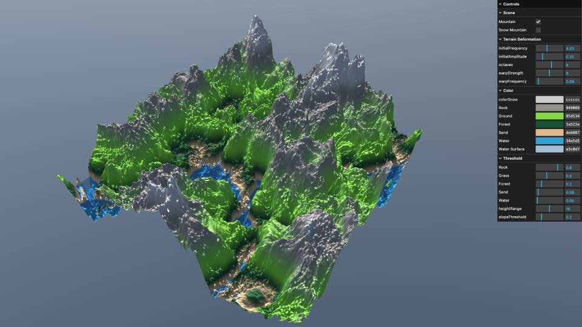

# Terrain TSL

日本語 | [English](./README.md)

Three.js TSL（Three.js Shading Language）で構築されたプロシージャル地形レンダリングプロジェクト。動的な地形生成のシミュレーションを行ってます。

**[👉 ライブデモ](https://www.styublog.com/shader/terrain)**

## 参考

- [GPU Gem3](https://developer.nvidia.com/gpugems/gpugems3/foreword)
- [Three.js Example](https://threejs.org/examples/?q=tsl#webgpu_tsl_procedural_terrain)

## SNS

- 🐦 Twitter/X: [@tama20013](https://x.com/tama20013)
- 🎥 YouTube: [Studio Tama](https://www.youtube.com/@studioTama)
